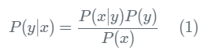
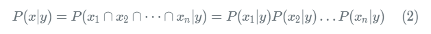
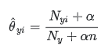
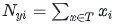
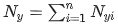
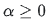
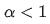

# Thuật toán Naive Bayes dùng trong Text Classification với thư viện Scikit-learn

## 1. Thư viện Scikit-learn  

Scikit-learn (viết tắt là Sklearn) là một thư viện mã nguồn mở dành cho Machine Learning - một ngành trong trí tuệ nhân tạo, rất mạnh mẽ và thông dụng với cộng đồng Python, được thiết kế trên nền NumPy và SciPy. Scikit-learn chứa hầu hết các thuật toán Machine Learning hiện đại nhất, đi kèm với documentations luôn được cập nhật.  

Tại sao chọn thư viện Scikit-learn để giải quyết bài toán này?  

- Hỗ trợ hầu hết các thuật toán của Machine Learning một cách đơn giản, hiệu quả mà chúng ta không cần phải mất công ngồi cài đặt lại. Scikit-learn có hỗ trợ 4 loại mô hình thuật toán Naive Bayes: Gaussian Naive Bayes, Multinomial Naive Bayes, Complement Naive Bayes, Bernoulli Naive Bayes. Tùy vào loại dữ liệu của bài toán cần giải quyết mà lựa chọn mô hình thuật toán Naive Bayes thích hợp. Với bài toán của mình, chúng ta sẽ dùng mô hình **Multinomial Naive Bayes**.
- Có tài liệu hướng dẫn sử dụng.
- Độ tin cậy cao do Scikit-learn được xây dựng bởi các chuyên gia hàng đầu.
- Có nguồn dữ liệu phong phú: iris, digit, …

## 2. Thuật toán Naives Bayes  

### 2.1. Định nghĩa  
**Naive Bayes Classifier (NBC)** là một thuật toán phân loại dựa trên tính toán xác suất áp dụng định lý Bayes. Thuật toán này thuộc nhóm Supervised Learning (Học có giám sát). Đây là hướng tiếp cận phân lớp theo mô hình xác suất. Dự đoán xác suất một đối tượng mới thuộc về thành viên của lớp đang xét.  

**Định lý Bayes** là một định lý toán học để tính xác suất xảy ra của một sự kiện ngẫu nhiên A khi biết sự kiện liên quan B đã xảy ra. Định lý này đặt theo tên nhà toán học Thomas Bayes, người Anh sống ở thế kỷ 18. Đây là một trong những công cụ vô cùng hữu ích, người bạn thân của các Data Scientist, những người làm trong ngành khoa học dữ liệu.  
  
Theo định lý Bayes, ta có công thức tính xác suất ngẫu nhiên của sự kiện *Y* khi biết *X* như sau:  
  
Giả sử ta phân chia 1 sự kiện *X* thành *n* thành phần khác nhau *X1, X2, ..., Xn*. Naive Bayes theo đúng như tên gọi dựa vào một giả thiết ngây thơ rằng *X1, X2, ..., Xn* là các thành phần độc lập với nhau. Từ đó ta có thể tính được:  
  
Do đó ta có:  
  
Trên thực tế thì ít khi tìm được dữ liệu mà các thành phần là hoàn toàn độc lập với nhau. Tuy nhiên giả thiết này giúp cách tính toán trở nên đơn giản, training data nhanh, đem lại hiệu quả bất ngờ với các lớp bài toán nhất định.  

### 2.2. Mô hình Multinomial Naive Bayes  
#### 2.2.1. Công thức  
Ở mô hình này, các feature vector là các giá trị số tự nhiên mà giá trị thể hiện số lần từ đó xuất hiện trong văn bản. Ta tính xác suất từ xuất hiện trong văn bản *P(Xi|Y)* như sau:  
  
Trong đó:  
 là tổng số lần xuất hiện trong văn bản training T của từ i.  
 là tổng số lần xuất hiện trong văn bản training T của tất cả bộ từ vựng.  
*n* kích thước của bộ từ vựng.  
*alpha*  có ý nghĩa giải thích cho các từ không có trong bộ từ vựng học và ngăn chặn xác suất bằng 0 cho các tính toán tiếp theo.  
 gọi là Laplace Smoothing.  
 gọi là Lidstone Smoothing.  
Chúng ta có thể thấy rằng khi *alpha* thay đổi:  
- Nếu *alpha* nhỏ => phương sai cao.  
- Nếu *alpha* lớn => độ lệch cao.  
Câu hỏi đặt ra là làm thế nào để xác định đúng *alpha*?  
Câu trả lời chính là cross-validation. Do đó, *alpha* là siêu tham số (hyperparameter).   

### 2.3. Đánh giá  

Ưu điểm:  

- Naive Bayes Classifiers với công thức tính toán đơn giản nên dễ cài đặt, thời gian training và test nhanh, phù hợp với bài toán data lớn. Thực hiện khá tốt trong Multi class Prediction.  
- Khi giả định rằng các feature của dữ liệu là độc lập với nhau thì Naive Bayes chạy tốt hơn so với các thuật toán khác như Logistic Regression và cũng cần ít dữ liệu hơn, thời gian thực thi tương tự như cây quyết định.  
- Đạt kết quả tốt trong phần lớn các trường hợp.  

Khuyết điểm:  

- Trong thực tế, hầu như là bất khả thi khi giả thiết các feature của dữ liệu test là độc lập với nhau. Điều này làm giảm độ chính xác.  
- Cần chú ý sử dụng Smoothing để tránh lỗi xác suất tổng được bằng 0 khi xác suất của một feature thành phần bằng 0.

References:  

1. https://scikit-learn.org/stable/modules/naive_bayes.html  

2. https://scikit-learn.org/stable/modules/generated/sklearn.naive_bayes.MultinomialNB.html#sklearn.naive_bayes.MultinomialNB  

3. https://scikit-learn.org/stable/modules/classes.html#module-sklearn.naive_bayes  
