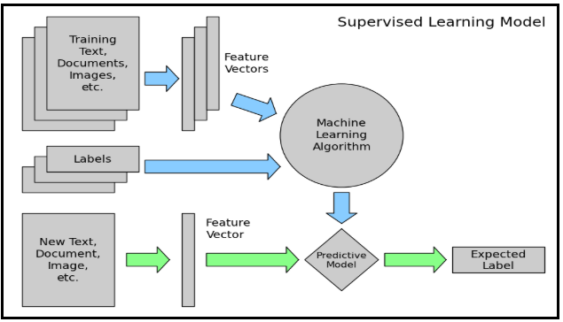
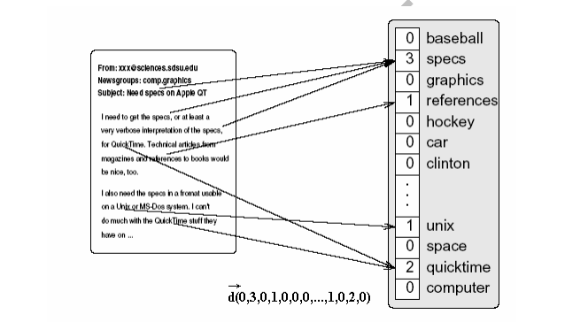

# Phân loại văn bản (Text Classification)

## I. Tổng quát

### 1. Mô hình khái quát cho bài toán phân lớp

*[report-on-text-classification-using-cnn-rnn-han][4]*

Ban đầu sẽ chia bộ dữ liệu (dataset) thành 2 phần: data train và data test. Tổng thể một bài toán phân lớp sẽ chia thành 2 công việc:

- Huấn luyện:  
Dùng bộ **Training Text** (data train) rút trích thành các bộ **Features Vertor** đưa vào **Machine Learining Algorithm** từ đó thành một **Predictive Model** dùng để phân loại sau này, cuối cùng kết quả sẽ thu được **Expect Label** tên lớp cần phân loại.
- Hiện thực kết quả:  
Dùng **Text** (data test) rút trích thành các bộ **Features Vertor** đưa vào **Predictive Model** sẽ nhận được **Expect Label** tên lớp cần phân loại.

Mô hình bài toán phân lớp khá đơn giản, bao gồm các thành phần:

- Training text: Đây là văn bản đầu vào thông qua đó mô hình supervised learning có thể học (learn) và dự đoán (predict) được phân lớp/ phân loại (categories/classes).
- Feature Vector: là một vertor chứa thông tin mô tả các đặc điểm của dữ liệu đầu vào.
- Labels: Đây là các danh mục/ lớp (categories/classes) được xác định trước mà mô hình sẽ dự đoán.
- ML Algo: Đây là thuật toán mà qua đó mô hình có thể xử lý phân loại văn bản (CNN, RNN, HAN,...).
- Predictive Model: Một mô hình đã được train/learn dựa trên bộ dữ liệu train và mô hình này có thể thực hiện dự đoán nhận biết được nhãn (categories/classes) nào khi nhập từ bộ dữ liệu test.

### 2. Quy trình tổng quan hiện thực bài toán phân loại văn bản

 

*[gioi-thieu-tien-xu-ly-trong-xu-ly-ngon-ngu-tu-nhien][1]*

Luồng xử lý cơ bản:  

**Crawler data** (cào dữ liệu) -> **text normalization** (chuẩn hóa dữ liệu) -> **data preprocessing** (tiền xử lý dữ liệu) -> **features** (trích xuất đặc trưng) -> **learn/train model** (chọn model machine learning và huấn luyện) -> **evaluation/results** (đánh giá kết quả).

Trong đó:

- **Crawler data** (cào dữ liệu): Là công đoạn chuẩn bị tập dataset (bộ dữ liệu để sử dụng) được lấy từ nhiều nguồn khác nhau như website. Ví dụ, lấy 3 triệu bài báo từ 5 trang web tin tức nổi tiếng nhất Việt Nam.
- **Text normalization** (chuẩn hóa dữ liệu): Công đoạn loại bỏ các thành phần không cần thiết từ dữ liệu mới crawler được có thể hiểu là làm sạch dữ liệu xóa đi dữ liệu rác cuối cùng nhận được đoạn văn bản chỉ có text. Ví dụ, xóa đi tag HTML, xóa link, xóa ký tự đặc biệt "\n \t &#64",...
- **Data preprocessing** (tiền xử lý dữ liệu): Chuyển dữ liệu/ văn bản nhận được ở giai đoạn trên thành dữ liệu đầu vào (data input) thích hợp cho đúng với mô hình (model machine learning) sử dụng phân loại văn bản. Ví dụ, các công việc cần thực hiện trước khi đưa vào thuật toán phân loại văn bản tiếng Việt như: tách từ, chuẩn hóa từ, loại bỏ stopwords, vertor hóa từ. Đây là công đoạn quan trọng trong bài toán phân loại văn bản. Tham khảo: *[gioi-thieu-tien-xu-ly-trong-xu-ly-ngon-ngu-tu-nhien][2]*.
- **Features** (trích xuất đặc trưng): Với bài toán phân loại trên thực tế, khi muốn phân loại cần phải dựa theo một đặc điểm nào đó như giới tính, hình dạng, kích thước dựa trên sự quan sát hoặc số liệu cụ thể. Trong bài toán phân loại cũng vậy, nhưng nó đòi hỏi việc phải tự động phát hiện ra các đặc điểm của đối tượng rồi mới thực hiện phân loại cho phù hợp. Ví dụ, phân loại hoa Hồng, phải phát hiện ra mỗi hoa đó có đặc điểm như thế nào xét cả về hình dạng, màu, kích thước, giống, mùi hương. Một đối tượng có rất nhiều đặc điểm, vậy dựa trên một hoặc nhiều đặc điểm nào để phân loại? Vì thế công đoạn này sẽ rúc trích hay lựa chọn bộ đặc điểm nào tối ưu nhất, dễ nhận dạng nhất, dễ phát hiện ra đối tượng đó nhất. Cuối cùng công đoạn này sẽ thu được một tập dữ liệu đã được trích xuất sau đó đưa vào thuật toán machine learning phân loại. Có 2 loại feature:
  - Feature Selection (chọn lựa đặc trưng): là *chọn* ra một tập đặc trưng con từ không gian đặc trưng gốc.
  - Feature Extraction (rút trích đặc trưng): là *biến đổi* (transform) không gian đặc trưng gốc thành một không gian đặc trưng nhỏ hơn để giảm số chiều đặc trưng. So với phương pháp chọn đặc trưng, rút trích không chỉ giảm số chiều mà còn thành công trong việc giải quyết vấn đề tính nhiều nghĩa (polysemy) và tính đồng nghĩa (synonym) của từ ở mức độ có thể chấp nhận. Xem thêm: *[LuanVanDaiHoc_2006_CNTT_DHKHTN-HCM_Vu_Nguyen_protected.pdf][3]*
- **Learn/train model** (chọn model machine learning và huấn luyện): Lựa chọn một thuật toán tối ưu nhất cho bài toán phân loại văn bản.
- **Evaluation/results** (đánh giá kết quả): Công đoạn cuối, đánh giá kết quả nhận được.

### 3. Quy trình cụ thể hiện thực bài toán phân loại văn bản

 

*[LuanVanDaiHoc_2006_CNTT_DHKHTN-HCM_Vu_Nguyen_protected.pdf][3]*

Hầu hết các phương pháp máy học áp dụng cho bài toán phân loại văn bản
đều sử dụng cách biểu diễn văn bản dưới dạng véc tơ đặc trưng. Điểm khác biệt duy nhất chính là không gian đặc trưng được chọn lựa. Tuy nhiên ở đây ta thấy nảy sinh một vấn đề cơ bản: Số lượng từ xuất hiện trong văn bản sẽ rất lớn. Như vậy, mỗi véc tơ có thể có hàng ngàn đặc trưng, hay nói cách khác mỗi véc tơ sẽ có số chiều rất lớn. Do vậy các véc tơ sẽ không đồng nhất về kích thước.

Để giải quyết vấn đề thông thường chúng ta sẽ chọn lựa những đặc trưng
được đánh giá là hữu ích, bỏ đi những đặc trưng không quan trọng. Đối với phân loại văn bản, quá trình này rất quan trọng bởi vì véc tơ văn bản có số chiều rất lớn (>>10000), trong đó số thành phần dư thừa cũng rất nhiều. Vì vậy các phương pháp chọn lựa đặc trưng rất hiệu quả trong việc giảm chiều của véc tơ đặc trưng văn bản, chiều của véc tơ văn bản sau khi được giảm chỉ còn lại khoảng 1000 đến 5000 mà không mất đi độ chính xác phân loại. *(copy & paste)*

### 4. Model Parameter và Model Hyperparameter

https://viblo.asia/p/mot-vai-hieu-nham-khi-moi-hoc-machine-learning-4dbZNoDnlYM (Siêu tham số, làm sao lựa chọn thuật toán phù hợp)

### 5. Các thuật ngữ trong xử lý ngôn ngữ tự nhiên

https://ongxuanhong.wordpress.com/2016/02/05/cac-thuat-ngu-trong-xu-ly-ngon-ngu-tu-nhien/

## II. Phân tích bài toán phân loại văn bản trong tiếng Việt

Việc áp dụng phương pháp phân loại trong tiếng Việt còn khó khăn:

- Không có tập dữ liệu chuẩn cho việc phân loại.
- Chưa có thống nhất về font và dấu câu.
- Biểu diễn văn bản Tiếng Việt còn nhiều trở ngại do bị phụ thuộc nhiều vào phương pháp tách từ. Vì phương pháp này áp dụng đối với tiếng Việt không đạt hiệu quả cao như tiếng Anh. Vì vậy, để có thể áp dụng tốt các thuật toán phân loại hiệu quả cao trong ngôn ngữ tiếng Anh thì phải tìm ra một phương pháp tách từ tốt. Trong tiếng Anh đơn vị nhỏ nhất là "từ" trong khi tiếng Việt là "tiếng" và khoảng trắng ngăn cách không thể hiện rõ đâu là "từ" vì phải phụ thuộc vào ngữ cảnh. Vì vậy, trước khi phân loại phải phải tìm hiểu về cách tách từ trong tiếng Việt.

### Khái niệm chung

- **POS tagging** (gán nhãn từ loại): là việc phân loại các từ trong một câu (danh từ, trạng từ, tính từ hay động từ, v.v..), xem thêm: [nlp-part-of-speech-pos][7]
- **Word segmentation** (tách từ): tách một đoạn text (một chuỗi liên tiếp các ký tự) thành những từ (word hay token) riêng lẻ, xem thêm: [nlp-word-segmentation][8], [Vietnamese Word Segmentation][9]
- **Named Entity Recognition** (gán nhãn boundary (ranh giới) và type (thể loại)): phân loại text trong văn bản thành những loại xác định trước như là tên người, tổ chức, địa điểm, thời gian, số lượng, giá trị tiền tệ, phần trăm. “American Airlines[ORG]”, một đơn vị của “AMR Corp.[ORG]”, ngay lâp tức có những động thái phù hợp, phát ngôn viên “Tim Wagner[PER]” cho biết, xem thêm: [Nhận_dạng_thực_thể_có_tên][10], [named-entity-recognition][11]

### 1. Tách từ

Bối cảnh tách từ trong tiếng Việt và tiếng Hoa.

 

*[phan-loai-tintucbaodientu - 3.2.1][5]*

Các phương pháp tiếp cận tách từ:

- Dựa trên từ (Word-based approaches)
- Dựa trên ký tự (Character-based approaches)

### 2. Biểu diễn văn bản dưới dạng vertor đặc trưng

https://www.slideshare.net/duyvong3/phan-loai-tintucbaodientu-40099422 2.2.1

Bước đầu tiên của hầu hết thuật toán phân loại văn bản là chuyển mô tả văn bản thành một dạng mô tả khác sao cho phù hợp với thuật toán. Hầu hết các thuật toán phân loại đều sử dụng cách biểu diễn văn bản sử dụng vertor đặc trưng.

### 3. Các thuật toán/ model trong phân loại văn bản tiếng Anh

- https://www.slideshare.net/duyvong3/phan-loai-tintucbaodientu-40099422 2.2.1
- https://github.com/duyvuleo/VNTC/blob/master/Report/LuanVanDaiHoc_2006_CNTT_DHKHTN-HCM_Vu_Nguyen_protected.pdf

### 4. Cách đánh giá thuật toán/ model

https://viblo.asia/p/mot-vai-hieu-nham-khi-moi-hoc-machine-learning-4dbZNoDnlYM 

## III. Tools

- Numpy/Scipy: thư viện tính toán số học cơ bản.
- Matplotlib: thư viện dùng để vẽ đồ thị, biểu đồ, v.v…
- **Jupyter Notebook**: Web editor, có thể vừa thực thi vừa confirm kết quả.
- **Pandas**: thư viện xử lý lượng lớn data nhanh chóng.
- **Scikit-Learn**: thư viện chuẩn dành cho Machine Learning của Python.
- **Gensim**: thư viện xử lý ngôn ngữ tự nhiên chuyên biệt về topic model.
- TensorFlow: engine/library được phát triển bởi Google dành cho Deep Learning.

Trích từ: *[7-librarytool-nen-biet-khi-bat-dau-machine-learningdeep-learning-tren-python][6]*

## Tham khảo

- https://codetudau.com/machine-learning-nlp-scikit-learn/index.html
- https://viblo.asia/p/mot-vai-hieu-nham-khi-moi-hoc-machine-learning-4dbZNoDnlYM (Siêu tham số, làm sao lựa chọn thuật toán phù hợp)
- https://codetudau.com/gioi-thieu-tien-xu-ly-trong-xu-ly-ngon-ngu-tu-nhien/index.html
- https://codetudau.com/tim-kiem-high-parameter-voi-scikit-learn/
- https://medium.com/jatana/report-on-text-classification-using-cnn-rnn-han-f0e887214d5f
- http://vlsp.org.vn:8080/vitk/ (demo)

[1]:https://codetudau.com/gioi-thieu-tien-xu-ly-trong-xu-ly-ngon-ngu-tu-nhien/index.html
[2]:https://codetudau.com/gioi-thieu-tien-xu-ly-trong-xu-ly-ngon-ngu-tu-nhien/index.html
[3]:https://github.com/duyvuleo/VNTC/blob/master/Report/LuanVanDaiHoc_2006_CNTT_DHKHTN-HCM_Vu_Nguyen_protected.pdf
[4]:https://medium.com/jatana/report-on-text-classification-using-cnn-rnn-han-f0e887214d5f 
[5]:https://www.slideshare.net/duyvong3/phan-loai-tintucbaodientu-40099422
[6]:https://studylinux.wordpress.com/2017/11/03/7-librarytool-nen-biet-khi-bat-dau-machine-learningdeep-learning-tren-python/#more-2612
[7]:https://chienuit.wordpress.com/2016/04/17/nlp-part-of-speech-pos/
[8]:https://chienuit.wordpress.com/2016/04/21/nlp-word-segmentation/
[9]:http://vlsp.org.vn:8080/vitk/tok/index.xhtml
[10]:https://vi.wikipedia.org/wiki/Nhận_dạng_thực_thể_có_tên
[11]:https://medium.com/@liennguyen_51419/17-1-named-entity-recognition-part-2-1-2287823bee3d