# I. TỔNG QUAN

## 1.1. Đặt vấn đề

Với sự phát triển vượt bậc của công nghệ thông tin đặc biệt là sự bùng nổ của mạng internet, lượng thông tin được số hóa và đưa lên mạng ngày càng nhiều. Internet trở thành một kho kiến thức khổng lồ về mọi lĩnh vực. Do đó, số lượng văn bản xuất hiện trên mạng internet cũng tăng theo với tốc độ chóng mặt. Số lượng trang web cũng như lượng thông tin đang tăng một cách rất nhanh, đặc biệt với những bài báo điện tử. Với nhu cầu thực tế của người sử dụng, tìm kiếm thông tin nội dung liên quan đến những chủ đề lĩnh vực quan tâm vẫn còn là một thách thức to lớn. Làm thế nào để tìm kiếm chính xác, làm thế nào để phân loại các thông tin theo chủ đề để dễ dàng truy xuất và phân tích nội dung phục vụ cho việc thống kê, nghiên cứu dự đoán dựa trên những thông tin được phân loại đó.

Để giải quyết vấn đề, một phương pháp hoặc một hệ thống để phân loại tin tức được tổng hợp từ các trang báo điện tử là hết sức cần thiết.

## 1.2. Các phương pháp phân loại văn bản

Mỗi phương pháp phân loại văn bản đều có cách tính toán khác nhau. Nhìn một cách tổng quan thì các phương pháp đều thực hiện một số bước chung như sau: đầu tiên, mỗi phương pháp sẽ dựa trên các thông tin về sự xuất hiện của từ trong văn bản (ví dụ tần số, số văn bản chứa từ...) để biểu diễn văn bản thành dạng vector; sau đó, tuỳ từng phương pháp mà ta sẽ áp dụng công thức và phương thức tính toán khác nhau để thực hiện việc phân loại.

Phân loại văn bản tự động trong tiếng Anh đã có rất nhiều công trình nghiên cứu và đạt được kết quả đáng khích lệ. Dựa trên các thống kê của Yang & Xiu (1999), một số phương pháp phân loại thông dụng hiện nay là: Support Vector Machine [Joachims, 1998], k-Nearest Neighbor [Yang, 1994], Linear Least Squares Fit [Yang and Chute, 1994] Neural Network [Wiener et al, 1995], Naïve Bayes [Baker and Mccallum, 2000], Centroid-based [Shankar and Karypis, 1998]. Các phương pháp trên đều dựa vào xác suất thống kê hoặc thông tin về trọng số của từ trong văn bản.

Đối với tiếng Anh, các kết quả trong lĩnh vực này rất khả quan, còn đối với tiếng Việt, các công trình nghiên cứu về phân loại văn bản gần đây đã có một số kết quả ban đầu nhưng vẫn còn nhiều hạn chế. Nguyên nhân là ngay ở bước đầu tiên, chúng
ta đã gặp khó khăn trong việc xử lý văn bản để rút ra tần số xuất hiện của từ. Trong khi đó, để phân loại văn bản thì có thể nói bước đầu tiên là quan trọng nhất bởi vì nếu ở bước tách từ đã sai thì việc phân loại hầu như không thể thành công được.

## 1.3. Tách từ Tiếng Việt

Đối với tiếng Anh, từ là một nhóm các ký tự có nghĩa được tách biệt với nhau
bởi khoảng trắng trong câu, do vậy việc tách từ trở nên rất đơn giản. Trong khi đối với tiếng Việt, ranh giới từ không được xác định mặc định là khoảng trắng mà tùy thuộc vào ngữ cảnh dùng câu tiếng Việt. Ví dụ các từ trong tiếng Anh là “book”, “cat”, “stadium” thì trong tiếng Việt là “quyển sách”, “con mèo”, “sân vận động”,... Vấn đề trên thực sự đưa ra một thách thức to lớn.

Gần đây, một phương pháp tách từ mới được giới thiệu có ưu điểm là không cần dùng tập ngữ liệu hay từ điển để lấy thông tin thống kê hay trọng số của từ, đó là phương pháp Internet and Genetics Algorithm-based Text Categorization (IGATEC) của H.Nguyen et al (2005). Điểm sáng tạo của thuật toán là kết hợp thuật toán di truyền với việc trích xuất thông tin thống kê từ Internet thông qua một công cụ tìm kiếm (như Google chẳng hạn) thay vì lấy từ tập ngữ liệu như các phương pháp trước.

## 1.4. Mục tiêu đồ án

Trong pham vi đồ án này, nhóm sẽ tập trung tìm hiểu về cách thức phân loại văn bản trong Tiếng Việt cụ thể là phân loại các bài báo tin tức được lấy từ các trang báo điện tử lớn ở Việt Nam.

Song song đó, nhóm cũng tìm hiểu ở mức cơ bản một số phương pháp phân loại văn bản hiện có đang áp dụng cho tiếng Anh như Support vector Machine (SVM), K–Nearest Neighbor (kNN) và Naïve Bayes (NB) để có cái nhìn tổng quan và cơ bản nhất.

Cuối cùng sẽ áp dụng phương pháp Naïve Bayes để giải quyết bài toán phân loại bài báo trong Tiếng Việt, từ việc thu thập dữ liệu trên internet, rồi đến làm sạch dữ liệu, tiền xử lý dữ liệu, rút trích đặc trưng, tách từ, áp dụng model, training model và cuối cùng là đưa ra nhận xét và đánh giá.

# II. CÁC PHƯƠNG PHÁP PHÂN LOẠI VĂN BẢN TIẾNG ANH

## 2.1. Tổng quan về các phương pháp phân loại văn bản hiện nay

Để phân loại văn bản người ta sử dụng nhiều cách tiếp cận khác nhau như dựa trên từ khóa, dựa trên ngữ nghĩa các từ có tần số xuất hiện cao, mô hình Maximum Entropy, tập thô... Tiếng Anh là một trong những ngôn ngữ được nghiên cứu sớm và rộng rãi nhất với kết quả đạt được rất khả quan. Một số lượng lớn các phương pháp phân loại đã được áp dụng thành công trên ngôn ngữ này : mô hình hồi quy [Fuhr et al,1991], phân loại dựa trên láng giềng gần nhất (k-nearest neighbors) [Dasarathy, 1991], phương pháp dựa trên xác suất Naïve Bayes [Joachims, 1997], cây quyết định [Fuhr et al,1991], học luật quy nạp [William & Yoram, 1996], mạng nơron (neural network) [Wiener et al, 1995], học trực tuyến[William & Yoram, 1996], và máy vector hỗ trợ (SVM-support vector machine) [Vapnik, 1995]. Hiệu quả của các phương pháp này rất khác nhau ngay cả khi áp dụng cho tiếng Anh. Việc đánh giá gặp nhiều khó khăn do việc thiếu các tập ngữ liệu huấn luyện chuẩn. Thậm chí đối với tập dữ liệu được sử dụng rộng rãi nhất, Reuter cũng có nhiều phiên bản khác nhau. Hơn nữa, có rất nhiều độ đo được sử dụng như recall,
precision, accuracy hoặc error, break-even point, F-measure... Chương này giới thiệu các thuật toán phân loại được sử dụng phổ biến nhất đồng thời so sánh giữa các phương pháp sử dụng kết quả của [Yang, 1997].

## 2.2. Một số phương pháp phân loại văn bản tiếng Anh hiện hành

### 2.2.1. Support vector Machine (SVM)

SVM là phương pháp tiếp cận phân loại rất hiệu quả được Vapnik giới thiệu năm 1995 [Vapnik, 1995] để giải quyết vấn đề nhận dạng mẫu 2 lớp sử dụng nguyên lý Cực tiểu hóa Rủi ro có Cấu trúc (Structural Risk Minimization) [Vapnik, Cortes, 1995].

#### 2.2.1.1 Ý tưởng

Cho trước một tập huấn luyện được biểu diễn trong không gian vector trong đó mỗi tài liệu là một điểm, phương pháp này tìm ra một siêu mặt phẳng h quyết định tốt nhất có thể chia các điểm trên không gian này thành hai lớp riêng biệt tương ứng
lớp + và lớp –. Chất lượng của siêu mặt phẳng này được quyết định bởi khoảng cách (gọi là biên) của điểm dữ liệu gần nhất của mỗi lớp đến mặt phẳng này. Khoảng cách biên càng lớn thì mặt phẳng quyết định càng tốt đồng thời việc phân loại càng chính xác. Mục đích thuật toán SVM tìm được khoảng cách biên lớn nhất. Hình sau minh họa cho thuật toán này:

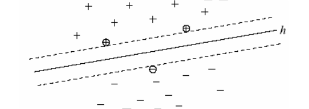

[Siêu mặt phẳng h phân chia dữ liệu huấn huyện thành 2 lớp + và – với khoảng cách biên lớn nhất. Các điểm gần h nhất là các vector hỗ trợ, Support Vector (được khoanh tròn)]

#### 2.2.1.2 Công thức

SVM thực chất là một bài toán tối ưu, mục tiêu của thuật toán này là tìm được một không gian H và siêu mặt phẳng quyết định trên H sao cho sai số phân loại là thấp nhất.

Phương trình siêu mặt phẳng chứa vector d(i) trong không gian như sau: d(i).w + b = 0

Bài toán SVM có thể giải bằng kỹ thuật sử dụng toán tử Lagrange để biến đổi thành dạng đẳng thức. Điểm thú vị ở SVM là mặt phẳng quyết định chỉ phụ thuộc vào các vector hỗ trợ (Support Vector) có khoảng cách đến mặt phẳng quyết định là 1/|w|. Khi các điểm khác bị xóa đi thì thuật toán vẫn cho kết quả giống như ban đầu. Chính đặc điểm này làm cho SVM khác với các thuật toán khác như kNN,LLSF, NNet và NB vì tất cả dữ liệu trong tập huấn luyện đều được dùng để tối ưu hóa kết quả.

### 2.2.2. K–Nearest Neighbor (kNN)

kNN là phương pháp truyền thống khá nổi tiếng về hướng tiếp cận dựa trên thống kê đã được nghiên cứu trong nhận dạng mẫu hơn bốn thập kỷ qua [Dasarathy, 1991]. kNN được đánh giá là một trong những phương pháp tốt nhất (áp dụng trên tập dữ liệu Reuters phiên bản 21450), được sử dụng từ những thời kỳ đầu của việc phân loại văn bản [Marsand et al, 1992] [Yang, 1994] [Iwayama, Tokunaga, 1995].

#### 2.2.2.1 Ý tưởng

Khi cần phân loại một văn bản mới, thuật toán sẽ tính khoảng cách (khoảng cách Euclide, Cosine ...) của tất cả các văn bản trong tập huấn luyện đến văn bản này để tìm ra k văn bản gần nhất (gọi là k “láng giềng”), sau đó dùng các khoảng cách này
đánh trọng số cho tất cả chủ đề. Trọng số của một chủ đề chính là tổng tất cả khoảng cách ở trên của các văn bản trong k láng giềng có cùng chủ đề, chủ đề nào không xuất hiện trong k láng giềng sẽ có trọng số bằng 0. Sau đó các chủ đề sẽ được
sắp xếp theo mức độ trọng số giảm dần và các chủ đề có trọng số cao sẽ được chọn là chủ đề của văn bản cần phân loại.

#### 2.2.2.2 Công thức

Trọng số của chủ đề c(j) đối với văn bản x:

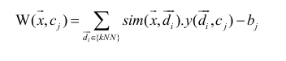

Để chọn được tham số k tốt nhất cho việc phân loại, thuật toán phải được chạy thử nghiệm trên nhiều giá trị k khác nhau, giá trị k càng lớn thì thuật toán càng ổn định và sai sót càng thấp [Yang, 1997]. Giá trị tốt nhất được sử dụng tương ứng trên hai bộ dữ liệu Reuter và Oshumed là k = 45 [Joachims, 1997].

### 2.2.3. Naïve Bayes (NB)

NB là phương pháp phân loại dựa vào xác suất được sử dụng rộng rãi trong lĩnh vực máy học [Mitchell, 1996] [Joachims, 1997] [Jason, 2001] được sử dụng lần đầu tiên trong lĩnh vực phân loại bởi Maron vào năm 1961 [Maron, 1961] sau đó trở nên phổ biến dùng trong nhiều lĩnh vực như trong các công cụ tìm kiếm [Rijsbergen et al, 1970], các bộ lọc mail [Sahami et al, 1998].

#### 2.2.3.1 Ý tưởng

Naive Bayes Classifier (NBC) là một thuật toán phân loại dựa trên tính toán xác suất áp dụng định lý Bayes. Thuật toán này thuộc nhóm Supervised Learning (Học có giám sát). Đây là hướng tiếp cận phân lớp theo mô hình xác suất. Dự đoán xác suất một đối tượng mới thuộc về thành viên của lớp đang xét.

Định lý Bayes là một định lý toán học để tính xác suất xảy ra của một sự kiện ngẫu nhiên A khi biết sự kiện liên quan B đã xảy ra. Định lý này đặt theo tên nhà toán học Thomas Bayes, người Anh sống ở thế kỷ 18. Đây là một trong những công cụ vô cùng hữu ích, người bạn thân của các Data Scientist, những người làm trong ngành khoa học dữ liệu.

Ý tưởng cơ bản của cách tiếp cận Naïve Bayes là sử dụng xác suất có điều kiện giữa từ và chủ đề để dự đoán xác suất chủ đề của một văn bản cần phân loại. Điểm quan trọng của phương pháp này chính là ở chỗ giả định rằng sự xuất hiện của tất cả các từ trong văn bản đều độc lập với nhau. Như thế NB không tận dụng được sự phụ thuộc của nhiều từ vào một chủ đề cụ thể.

Giả định đó làm cho việc tính toán NB hiệu quả và nhanh chóng hơn các phương pháp khác với độ phức tạp theo số mũ vì nó không sử dụng việc kếp hợp các từ để đưa ra phán đoán chủ đề.

#### 2.2.3.2 Công thức

Theo định lý Bayes, ta có công thức tính xác suất ngẫu nhiên của sự kiện *Y* khi biết *X* như sau:  
  
Giả sử ta phân chia 1 sự kiện *X* thành *n* thành phần khác nhau *X1, X2, ..., Xn*. Naive Bayes theo đúng như tên gọi dựa vào một giả thiết ngây thơ rằng *X1, X2, ..., Xn* là các thành phần độc lập với nhau. Từ đó ta có thể tính được:  
  
Do đó ta có:  
  
Trên thực tế thì ít khi tìm được dữ liệu mà các thành phần là hoàn toàn độc lập với nhau. Tuy nhiên giả thiết này giúp cách tính toán trở nên đơn giản, training data nhanh, đem lại hiệu quả bất ngờ với các lớp bài toán nhất định.  

# III. CÁC PHƯƠNG PHÁP TÁCH TỪ TIẾNG VIỆT HIỆN NAY

## 3.1. Tổng quan về các phương pháp tách từ Tiếng Việt

So với Tiếng Anh, tách từ trong Tiếng Việt có nhiều điểm khác, dưới đây là bản so sánh qua nhiều điểm được tổng hợp dựa trên bảng công bố của [Đinh Điền, 2004].

| Đặc điểm của Tiếng Việt                                                                                                                                                      | Đặc điểm của Tiếng Anh                                                                                                                      |
|------------------------------------------------------------------------------------------------------------------------------------------------------------------------------|---------------------------------------------------------------------------------------------------------------------------------------------|
| Được xếp là loại hình đơn lập (isolate) hay còn gọi là loại hình phi hình thái, không biến hình, đơn tiết.                                                                   | Là loại hình biến cách (flexion) hay còn gọi là loại hình khuất chiết.                                                                      |
| Từ không biến đổi hình thái, ý nghĩa ngữ pháp nằm ở ngoài từ. Ví dụ : Chị ngã em nâng và Em ngã chị nâng.                                                                    | Từ có biến đổi hình thái, ý nghĩa ngữ pháp nằm ở trong từ. Ví dụ: I see him và He sees me.                                                  |
| Phương thức ngữ pháp chủ yếu: trật tự từ và hư từ.                                                                                                                           | Phương thức ngữ pháp chủ yếu là : phụ tố.                                                                                                   |
| Ví dụ: Gạo xay và Xay gạo; đang học và học rồi; “nó bảo sao không tới”, “sao không bảo nó tới”, “sao không tới bảo nó”...                                                    |                                                                                                                                             |
| Ranh giới từ không được xác định mặc nhiên bằng khoảng trắng                                                                                                                 | Kết hợp giữa các hình vị là chặt chẽ, khó xác định, được nhận diện bằng khoảng trắng hoặc dấu câu.                                          |
| Tồn tại loại từ đặc biệt “từ chỉ loại” (classifier) hay còn gọi là phó danh từ chỉ loại kèm theo với danh từ, như: cái bàn, cuốn sách, bức thư, con chó, con sông, vì sao... | Hiện tượng cấu tạo bằng từ ghép thêm phụ tố (affix) vào gốc từ là rất phổ biến. Ví dụ: anticomputerizational (anti-compute-er-ize-ation-al) |
| Có hiện tượng láy và nói lái trong tiếng Việt. Ví dụ: lấp lánh, lung linh, hiện đại -> hại điện, thầy giáo -> tháo giầy...                                                   |                                                                                                                                             |

Như vậy:

Tiếng Việt là loại hình phi hình thái nên việc phân biệt loại từ (danh từ, động từ, tính từ ...) và ý nghĩa từ là rất khó, cho dù có sử dụng từ điển.

Việc tiền xử lý văn bản (tách từ, tách đoạn, tách câu...) sẽ thêm phức tạp với phần xử lý các hư từ, phụ từ, từ láy.

Phương thức ngữ pháp chủ yếu là trật tự từ nên nếu áp dụng phương pháp tính xác suất xuất hiện của từ có thể không chính xác như mong đợi.

Ranh giới từ không được xác định mặc nhiên bằng khoảng trắng. Điều này khiến cho việc phân tích hình thái (tách từ) tiếng Việt trở nên khó khăn. Việc nhận diện ranh giới từ là quan trọng làm tiền đề cho các xử lý tiếp theo sau đó, như: kiểm lỗi chính tả, gán nhãn từ loại, thống kê tần suất từ.

Vì giữa tiếng Anh và tiếng Việt có nhiều điểm khác biệt nên chúng ta không thể áp dụng y nguyên các thuật toán tiếng Anh cho tiếng Việt.

## 3.2. Một số phương pháp tách từ

Bối cảnh tách từ trong tiếng Việt và tiếng Hoa.

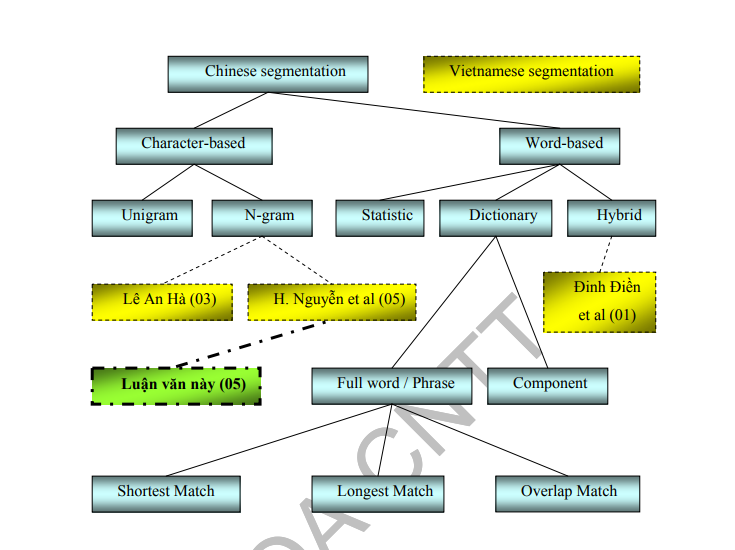 

[Các hướng tiếp cận cơ bản trong tách từ tiếng Hoa và các hướng tiếp cận hiện tại được công bố trong tách từ tiếng Việt]

### 3.2.1. Các hướng tiếp cận dựa trên từ (Word-based approaches)

Hướng tiếp cận dựa trên từ với mục tiêu tách được các từ hoàn chỉnh trong câu. Hướng tiếp cận này có hể chia ra là ba hướng: dựa trên thống kê (statistics-based), dựa trên từ điển (dictionary-based) và hydrid (kết hợp nhiều phương pháp với hy vọng đạt được những ưu điểm của các phương pháp này).

Công trình của Đinh Điền et al (2001) đã cố gắng xây dựng tập ngữ liệu huấn luyện riêng (khoảng 10M) dựa trên các thông tin có nguồn gốc từ internet như tin tức, e-book... Tuy nhiên tập ngữ liệu vẫn còn khá nhỏ để đảm bảo dung lượng và độ phong phú cho việc tách từ. Mặc khác, do tập ngữ liệu được xây dựng một cách thủ công, nên sẽ phần nào mang tính chủ quan. Và một hạn chế nữa là việc đánh giá lại được những thay đổi hằng ngày rất chậm, và có thể xảy ra hiện tượng flip-flop (hiện tượng khi khắc phục lỗi này lại dẫn đến lỗi khác không ngờ tới) Ở hướng tiếp cận dựa trên từ điển, các từ được tách phải tương ứng với những từ có trong từ điển. Hiện tại, ta vẫn chưa xây dựng được một bộ từ điển Việt Nam chứa toàn bộ các từ và ngữ.

### 3.2.2. Các hướng tiếp cận dựa trên ký tự (Character-based approaches)

Phải phân biệt rằng hình vị nhỏ nhất của tiếng Việt là “tiếng”, được cấu tạo bởi nhiều ký tự trong bảng chữ cái, trong khi hình vị nhỏ nhất của tiếng Hoa là một ký tự. Vì chữ viết tiếng Hoa là chữ tượng hình, không dựa trên bảng chữ cái Latin như tiếng Việt nên trong trường hợp tiếng Hoa, người ta xét hình vị là “ký tự”. Tuy nhiên, mỗi ký tự (character) trong tiếng Hoa được phát âm thành một “tiếng”, nên xét về mặt âm vị, ta có thể xem “tiếng” trong tiếng Hoa và tiếng Việt là tương tự nhau.

Mặc dù có cách viết khác nhau, nhưng về cấu tạo từ và ngữ pháp của tiếng Hoa và tiếng Việt có nhiều điểm tương đồng nhau. Xét về nguồn gốc, tiếng Việt là hình thức phiên âm của chữ Nôm do nhân dân ta sáng tạo nên, vốn có nguồn gốc từ tiếng Trung Hoa thời xưa.

### 3.2.2. Kết luận

Nhìn một cách tổng quan, phương pháp dựa trên từ (word-base) cho độ chính xác khá cao (trên 95%) nhờ vào tập ngữ liệu huấn luyện lớn, được đánh dấu chính xác, tuy nhiên hiệu suất của thuật toán phụ thuộc hoàn toàn vào ngữ liệu huấn luyên. Bởi vì mục đích của các tác giả [Đinh Điền et al, 2001] là thực hiện tách từ thật chính xác để phục vụ cho việc dịch máy nên tác giả đã chọn phương pháp WFST. Với các phương pháp cần phải sử dụng từ điển hoặc tập huấn luyện, ngoài việc tách từ thật chính xác, ta còn có thể nhờ vào các thông tin đánh dấu trong tập ngữ liệu để thực hiện các mục đích khác cần đến việc xác định từ loại như dịch máy, kiểm lỗi chính tả, từ điển đồng nghĩa... Do vậy, mặc dù thời gian huấn luyện khá lâu, cài đặt khá phức tạp, chi phí tạo tập ngữ liệu huấn luyện rất tốn kém, nhưng kết quả mà hướng tiếp cận dựa trên từ mang lại cho mục đích dịch máy là rất xứng đáng cho công sức bỏ ra.

Dựa trên kết quả của tác giả [Đinh Điền et al, 2001], trong đồ án này nhóm sẽ sử dụng phương pháp tách từ là word-base dựa trên lợi thế dễ dàng ứng dụng và độ chính xác chấp nhận được.

# IV. BÀI TOÁN PHÂN LOẠI TIN TỨC

## 4.1. Quy trình tổng quan hiện thực bài toán phân loại văn bản

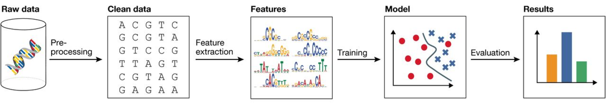 

Luồng xử lý cơ bản:  

**Crawler data** (cào dữ liệu) -> **text normalization** (chuẩn hóa dữ liệu) -> **data preprocessing** (tiền xử lý dữ liệu) -> **features** (trích xuất đặc trưng) -> **learn/train model** (chọn model machine learning và huấn luyện) -> **evaluation/results** (đánh giá kết quả).

Trong đó:

- **Crawler data** (cào dữ liệu): Là công đoạn chuẩn bị tập dataset (bộ dữ liệu để sử dụng) được lấy từ nhiều nguồn khác nhau như website. Ví dụ, lấy 3 triệu bài báo từ 5 trang web tin tức nổi tiếng nhất Việt Nam.
- **Text normalization** (chuẩn hóa dữ liệu): Công đoạn loại bỏ các thành phần không cần thiết từ dữ liệu mới crawler được có thể hiểu là làm sạch dữ liệu xóa đi dữ liệu rác cuối cùng nhận được đoạn văn bản chỉ có text. Ví dụ, xóa đi tag HTML, xóa link, xóa ký tự đặc biệt "\n \t &#64",...
- **Data preprocessing** (tiền xử lý dữ liệu): Chuyển dữ liệu/ văn bản nhận được ở giai đoạn trên thành dữ liệu đầu vào (data input) thích hợp cho đúng với mô hình (model machine learning) sử dụng phân loại văn bản. Ví dụ, các công việc cần thực hiện trước khi đưa vào thuật toán phân loại văn bản tiếng Việt như: tách từ, chuẩn hóa từ, loại bỏ stopwords, vertor hóa từ. Đây là công đoạn quan trọng trong bài toán phân loại văn bản. Tham khảo: *[gioi-thieu-tien-xu-ly-trong-xu-ly-ngon-ngu-tu-nhien][2]*.
- **Features** (trích xuất đặc trưng): Với bài toán phân loại trên thực tế, khi muốn phân loại cần phải dựa theo một đặc điểm nào đó như giới tính, hình dạng, kích thước dựa trên sự quan sát hoặc số liệu cụ thể. Trong bài toán phân loại cũng vậy, nhưng nó đòi hỏi việc phải tự động phát hiện ra các đặc điểm của đối tượng rồi mới thực hiện phân loại cho phù hợp. Ví dụ, phân loại hoa Hồng, phải phát hiện ra mỗi hoa đó có đặc điểm như thế nào xét cả về hình dạng, màu, kích thước, giống, mùi hương. Một đối tượng có rất nhiều đặc điểm, vậy dựa trên một hoặc nhiều đặc điểm nào để phân loại? Vì thế công đoạn này sẽ rúc trích hay lựa chọn bộ đặc điểm nào tối ưu nhất, dễ nhận dạng nhất, dễ phát hiện ra đối tượng đó nhất. Cuối cùng công đoạn này sẽ thu được một tập dữ liệu đã được trích xuất sau đó đưa vào thuật toán machine learning phân loại. Có 2 loại feature:
  - Feature Selection (chọn lựa đặc trưng): là *chọn* ra một tập đặc trưng con từ không gian đặc trưng gốc.
  - Feature Extraction (rút trích đặc trưng): là *biến đổi* (transform) không gian đặc trưng gốc thành một không gian đặc trưng nhỏ hơn để giảm số chiều đặc trưng. So với phương pháp chọn đặc trưng, rút trích không chỉ giảm số chiều mà còn thành công trong việc giải quyết vấn đề tính nhiều nghĩa (polysemy) và tính đồng nghĩa (synonym) của từ ở mức độ có thể chấp nhận. Xem thêm: *[LuanVanDaiHoc_2006_CNTT_DHKHTN-HCM_Vu_Nguyen_protected.pdf][3]*
- **Learn/train model** (chọn model machine learning và huấn luyện): Lựa chọn một thuật toán tối ưu nhất cho bài toán phân loại văn bản.
- **Evaluation/results** (đánh giá kết quả): Công đoạn cuối, đánh giá kết quả nhận được.

## 4.2. Quy trình rút trích đặc trưng trong bài toán phân loại văn bản

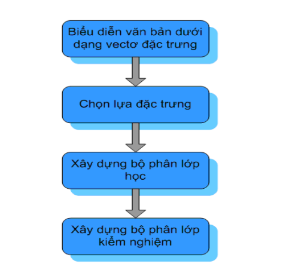 

Hầu hết các phương pháp máy học áp dụng cho bài toán phân loại văn bản đều sử dụng cách biểu diễn văn bản dưới dạng véc tơ đặc trưng. Điểm khác biệt duy nhất chính là không gian đặc trưng được chọn lựa. Tuy nhiên ở đây ta thấy nảy sinh một vấn đề cơ bản: Số lượng từ xuất hiện trong văn bản sẽ rất lớn. Như vậy, mỗi véc tơ có thể có hàng ngàn đặc trưng, hay nói cách khác mỗi véc tơ sẽ có số chiều rất lớn. Do vậy các véc tơ sẽ không đồng nhất về kích thước.

Để giải quyết vấn đề thông thường chúng ta sẽ chọn lựa những đặc trưng được đánh giá là hữu ích, bỏ đi những đặc trưng không quan trọng. Đối với phân loại văn bản, quá trình này rất quan trọng bởi vì véc tơ văn bản có số chiều rất lớn (>>10000), trong đó số thành phần dư thừa cũng rất nhiều. Vì vậy các phương pháp chọn lựa đặc trưng rất hiệu quả trong việc giảm chiều của véc tơ đặc trưng văn bản, chiều của véc tơ văn bản sau khi được giảm chỉ còn lại khoảng 1000 đến 5000 mà không mất đi độ chính xác phân loại.

## 4.3. Lý do chọn phương pháp Naïve Bayes

Naïve Bayes là một phương pháp rất phổ biến sử dụng xác suất có điều kiện giữa từ và chủ đề để xác định chủ đề của văn bản. Các xác suất này dựa trên việc thống kê sự xuất hiện của từ và chủ đề trong tập huấn luyện. Tập huấn luyện lớn có thể mang lại kết quả khả quan cho Naïve Bayes.

Với số lượng chủ đề tin tức điện tử không nhiều (khoảng 20 chủ đề) thì việc sử dụng các bài báo tiếng Việt có sẵn như cơ sở dữ liệu huấn luyện rất phù hợp. Trong báo chí, với mỗi chủ đề luôn có các từ chuyên môn với tần số xuất hiện rất cao, việc tận dụng tần số phụ thuộc của các từ này vào chủ đề có thể đem lại kết quả khả quan cho phân loại.

Mặt khác, phương pháp Naïve Bayes là phương pháp khá cổ điển được sử dụng đầu tiên bởi Maron vào năm 1961 [Maron, 1961], và sau đó rất phổ biến trong các lãnh vực tìm kiếm, lọc mail, các bộ lọc mail... nên có thể tin tưởng về xác suất chính xác và các ưu khuyết điểm của phương pháp này để áp dụng phù hợp.

Naïve Bayes bởi phương pháp đơn giản, tốc độ nhanh, cài đặt tương đối không quá phức tạp phù hợp với thời gian cho phép.

SVM tuy là một phương pháp được cho là có hiệu suất cao, nhưng thời gian huấn luyện lại rất lâu và đòi hỏi lượng dữ liệu huấn luyện lớn.

## 4.4. Thu thập dữ liệu và làm sạch dữ liệu (Raw Data và Clean Data)

## 4.5. Trích xuất đặc trưng (Feature Extraction)

## 4.6. Phân lớp văn bản (Implement Model và Train Model)  
### 4.6.1. Bộ phân lớp Naive Bayes  
Cho V1,V2, …, Vn là phân hoạch không gian mẫu V, mỗi Vi là một lớp. Không gian các thể hiện X gồm các thể hiện được mô tả bởi tập thuộc tính A1, A2, …, An. Không gian các thể hiện X là tập học. Khi có thể hiện mới với giá trị <a1,a2,…, an>, bộ phân lớp sẽ xuất hiện giá trị hàm phân lớp f(x) là một trong các Vi.
Tiếp cận Bayes lấy các giá trị có xác suất cao nhất VMAP cho thể hiện mới. Chữ MAP viết tắt của cụm từ Maximum A Posterior.  
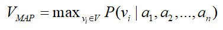  
Sử dụng định lý Bayes ta có:  
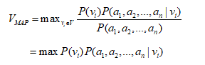  
Trong công thức trên có hai số hạng cần quan tâm là P(vi) và P(a1,a2,…,an). Ta tính P(vi) bằng cách đếm số lần xuất hiện của giá trị đích vi trong tập học. Để tính P(a1,a2,…,an) ta giả thuyết ban đầu các thuộc tính là độc lập. Nói cách khác, xác suất của một thể hiện quan sát được <a1, a2, …, an> trên mỗi lớp vi là tích của các khả năng của từng thuộc tính riêng biệt trên vi.  
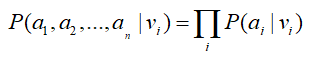  
Do vậy, công thức V_MAP được viết lại là:  
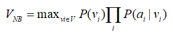  
với NB là viết tắt của cụm từ Naïve Bayes  
Bộ phân lớp Bayes liên quan đến bước học trong đó P(vj) và P(a1,a2,…,an) được tính dựa trên tập học.  
Để phân lớp ta dùng công thức:  
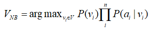  
Ví dụ:  
Cho bảng dữ liệu “Chơi bóng đá”  
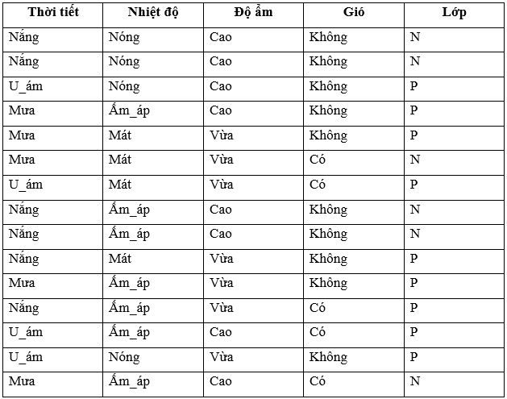  
Ta có thể tính các xác suất sau:  
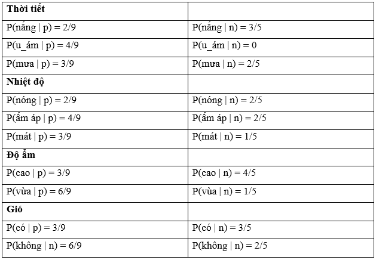  
Cuối cùng ta có P(p) = 9/14 và P(n) = 5/14  
Với bảng dữ liệu trên. Cho phân lớp X chưa được tìm thấy như sau X= < mưa, nóng, cao, không>  
Phân lớp X:  
Một mẫu chưa được gặp X = <mưa, nóng, cao, không>  
P(X|p)P(p) = P(mưa|p)P(nóng|p)P(cao|p)P(không|p)P(p) = 3/9x2/9x3/9x6/9x9/14=0.010582  
P(X|n)P(n)= P(mưa|n)P(nóng|n)P(cao|n)P(không|n)P(n) = 2/5x2/5x4/5x2/5/5/14=0.018286  
Vậy mẫu X được phân vào lớp n (không chơi bóng đá)  
### 4.6.2. Phân loại văn bản với Naive Bayes  
Phương pháp phân loại Bayes thực hiện việc phân loại bắt đầu với việc phân tích văn bản bằng cách trích những từ được chứa trong văn bản. Để thực hiện việc phân tích này, một thuật toán trích từ đơn giản để lấy ra những từ khác nhau trong văn bản. Những từ này sẽ được lưu vào một danh sách dùng để tính xác suất mỗi từ thuộc về mỗi loại. Danh sách từ sau đó sẽ được sử dụng để sinh ra một bảng chứa xác suất của từ đó thuộc về một loại. Bảng này sẽ gồm một cột “word” chứa các từ trong văn bản và một số cột xác suât của từ đó cho mỗi loại, tức là có bao nhiêu loại văn bản thì sẽ có bấy nhiêu cột xác suất. Giá trị của cột xác suất sẽ  tính theo công thức Bayes mà sẽ được trình bày ở bên dưới.  
Trước khi tính xác của từ thuộc về một loại nào, từ đó cần phải được huấn luyện bằng một tập dữ liệu huấn luyện được tổ chức, định dạng theo một qui chuẩn. Mỗi từ phân biệt từ các văn bản huấn luyện trong cùng một loại sẽ đưa vào danh sách xuất hiện từ cho loại đó.  
Dựa vào danh sách xuất hiện của từ, việc phân loại theo xác suất sẽ tiến hành tính toán xác suất hậu nghiệm của từ đó thuộc về một loại cụ thể bằng cách sử dụng công thức (2). Từ xuất hiện càng nhiều cho một loại thì xác suất càng càng cao, việc phân loại càng chính xác.  
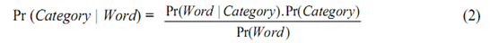  
Công thức trên cho thấy rằng bằng cách quan sát giá trị của một từ cụ thể wj, xác suất của một loại cụ thể Ci, Pr(Ci) có thể được chuyển thành xác suất hậu nghiệm Pr(Ci|wj). Pr(Ci|wj) là xác suất của từ wj thuộc về loại Ci. Pr(Ci) có thể được tính bằng công thức sau:  
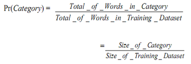  
Pr(wj) có thể được tính bằng công thức sau:  
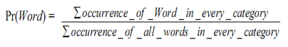  
Theo công thức Bayes trong phân loại văn bản, với giá trị của xác suất Pr(Category), Pr(Word|Category) và Pr(Word), xác suất hậu nghiệm Pr(Category | Word) của mỗi từ trong văn bản thuộc về một loại có thể được xác định.  
Xác suất hậu nghiệm của một từ thuộc về mỗi loại sẽ được điền vào bảng xác suất bên dưới  
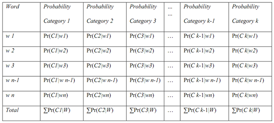  
Sau khi các ô xác suất được điền vào, xác suất tổng thể của một văn bản thuộc về một loại cụ thể Ci được tính bằng cách chia tổng mỗi cột xác suất cho tổng số từ trong văn bản.  
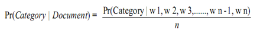  
trong đó w1, w2, w3, …., w n-1, wn là những từ được trích trong văn bản.  
Loại nào có xác suất Pr(Category | Document) cao nhất thì văn bản sẽ thuộc về loại đó theo luật phân loại Bayes.  

## 4.7. Một số cách đánh giá bài toán phân loại văn bản

Có nhiều cách để đánh giá mô hình:

### 4.7.1. Accuracy

Chia thành hai phần **training** và **testing** áp dụng một mô hình để train từ tập dữ liệu **training**. Tiếp theo sử dụng mô hình đó dự đoán trên tập **testing** và cuối cùng là tìm ra tỉ lệ số dữ liệu dự đoán đúng / tổng số dữ liệu testing.

### 4.7.2. Confusion matrix

Cách tính sử dụng accuracy như ở trên chỉ cho biết được bao nhiêu phần trăm lượng dữ liệu được phân loại đúng mà không chỉ ra được cụ thể mỗi loại được phân loại như thế nào, lớp nào được phân loại đúng nhiều nhất, và dữ liệu thuộc lớp nào thường bị phân loại nhầm vào lớp khác. Để có thể đánh giá được các giá trị này, chúng ta sử dụng một ma trận được gọi là confusion matrix.

Confusion matrix thể hiện có bao nhiêu điểm dữ liệu thực sự thuộc (actual) vào một class, và được dự đoán (predict) là rơi vào một class. Có tổng cộng 10 điểm dữ liệu và ma trận 3x3.

```text
 Total: 10 | Predicted | Predicted | Predicted |   
           |    as: 0  |    as: 1  |    as: 2  |   
-----------|-----------|-----------|-----------|---
 True: 0   |     2     |     1     |     1     | 4 
-----------|-----------|-----------|-----------|---
 True: 1   |     1     |     2     |     0     | 3 
-----------|-----------|-----------|-----------|---
 True: 2   |     0     |     1     |     2     | 3 
-----------|-----------|-----------|-----------|---
```

Ma trận thu được được gọi là confusion matrix. Nó là một ma trận vuông với **kích thước mỗi chiều bằng số lượng lớp dữ liệu**. Giá trị tại hàng thứ i, cột thứ j là số lượng điểm **lẽ ra thuộc vào class i nhưng lại được dự đoán là thuộc vào class j**. Như vậy, nhìn vào hàng thứ nhất (0), ta có thể thấy được rằng trong số bốn điểm thực sự thuộc lớp 0, chỉ có hai điểm được phân loại đúng, hai điểm còn lại bị phân loại nhầm vào lớp 1 và lớp 2.

Có thể suy ra ngay rằng tổng các phần tử trong toàn ma trận này chính là số điểm trong tập kiểm thử. Các phần tử trên đường chéo của ma trận là số điểm được phân loại đúng của mỗi lớp dữ liệu.

Suy ra **accuracy** chính bằng tổng các phần tử trên đường chéo chia cho tổng các phần tử của toàn ma trận.

Xem thêm: [evaluation-confusion-matrix][15]

### 4.7.3. Precision, Recall và F1-Score

Trong những bài toán này, người ta thường định nghĩa lớp dữ liệu quan trọng hơn cần được xác định đúng là lớp Positive (P-dương tính), lớp còn lại được gọi là Negative (N-âm tính). Ta định nghĩa True Positive (TP), False Positive (FP), True Negative (TN), False Negative (FN) dựa trên confusion matrix chưa chuẩn hoá như sau:

```text
                  |      Predicted      |      Predicted      |
                  |     as Positive     |     as Negative     |
------------------|---------------------|---------------------|
 Actual: Positive | True Positive (TP)  | False Negative (FN) |
------------------|---------------------|---------------------|
 Actual: Negative | False Positive (FP) | True Negative (TN)  |
------------------|---------------------|---------------------|
```

Cách tính Precision và Recall.


Precision cao đồng nghĩa với việc độ chính xác của các điểm tìm được là cao. Recall cao đồng nghĩa với việc True Positive Rate cao, tức tỉ lệ bỏ sót các điểm thực sự positive là thấp.

#### a. Precision (tỷ lệ chính xác) - bao nhiêu cái đúng được lấy ra

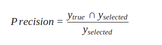

Xem xét trên tập dữ liệu kiểm tra (data-test) xem có **bao nhiêu dữ liệu được mô hình dự đoán đúng**. Tức là, số phát hiện đúng chia cho số đem đi kiểm thử. Đây chính là chỉ số accuracy - độ chính xác như bên trên. Giá trị càng cao, càng tốt.

#### b. Recall (tỷ lệ tái hiện) - bao nhiêu cái được lấy ra là đúng

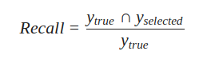

Recall được định nghĩa là tỉ lệ số điểm **true positive** trong số những điểm thực sự (actual) là **positive** (TP + FN).

Thể hiện tỉ lệ dự đoán chính xác của một dữ liệu.

#### c. F1-Score - trung bình điều hòa (harmonic mean)

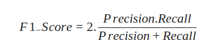

Đây được gọi là một trung bình điều hòa (harmonic mean) của các tiêu chí Precision và Recall. Nó có xu hướng lấy giá trị gần với giá trị nào nhỏ hơn giữa 2 giá trị Precision và Recall và đồng thời nó có giá trị lớn nếu cả 2 giá trị Precision và Recall đều lớn. Chính vì thế F1-Score thể hiện được một cách khách quan hơn performance của một mô hình học máy.

## 4.8. Kết quả thực nghiệm

## 4.9. Môi trường triển khai

Trong đồ án này, nhóm đã hiện thực bài toán phân loại văn bản tiếng Việt chạy trên môi trường Linux và một số thư viện hỗ trợ như bên dưới:

- Triển khai phần cứng: Ubuntu 16.4, Core™ i5, 2.30GHz × 4 (4 nhân 8 luồng), SSD, Mem 16G.
- Môi trường thực thi: Python 3.5.
- Các thư viện hỗ trợ:
  - Numpy/Scipy: thư viện tính toán số học cơ bản.
  - Matplotlib: thư viện dùng để vẽ đồ thị, biểu đồ.
  - Jupyter Notebook: trình soạn thảo và thực thi code có khả năng hiển thị kết quả thực thi được.
  - Pandas: thư viện dùng xử lý dữ liệu lớn một cách nhanh chóng và dễ dàng.
  - Scikit-Learn: thư viện chuẩn dành cho Machine Learning của Python, được hiện thực sẵn các model chỉ cần gọi và thực thi.
  - Gensim: thư viện xử lý ngôn ngữ tự nhiên chuyên biệt về topic model.

# V. Kết quả và hướng phát triển

## 5.1 Kết quả đạt được

## 5.2 Hướng phát triển

-------------------------------------------------------

Làm rõ được tại sao phải chọn Naive Bayes  
Các phương pháp tách từ trong Tiếng Việt
